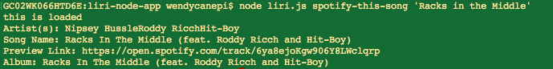
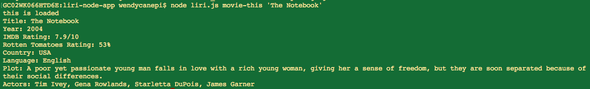
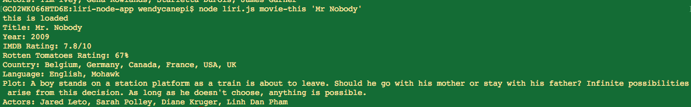

### Overview

## What is a LIRI? 

**LIRI**  is is a _Language_ Interpretation and Recognition Interface. LIRI will be a command line node app that takes in parameters and gives you back data.

##What does this LIRI do?

LIRI allows you to search for events by artist/band, song details on Spotify, and movie details on OMDB.

LIRI uses the Node-Spotify API, the OMDb API and Axios.

Search for song details on Spotify:

```node liri.js spotify-this-song <TITILE OF SONG>```




 

Search for movie details on OMDB:

```node liri.js movie-this <NAME OF MOVIE>```




Execute commands in a file:

```node liri.js do-what-it-says```

